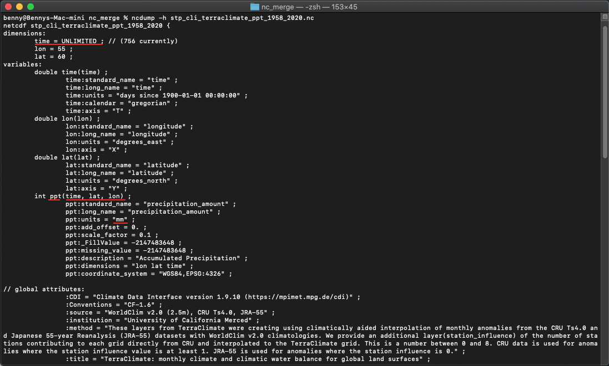
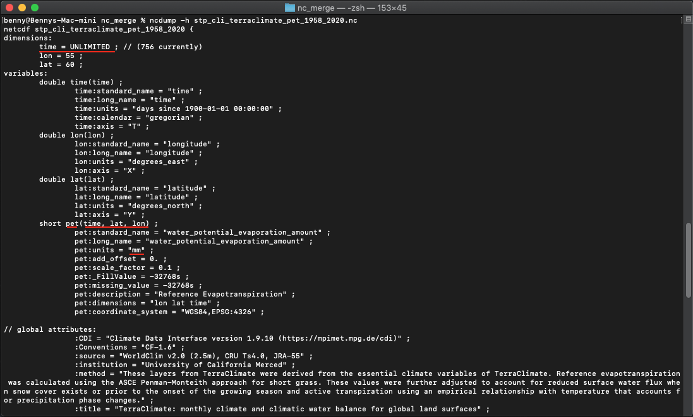

# SPEI using TerraClimate data

This section will explain on how to download TerraClimate's precipitation (ppt) and potential evapotranspiration (pet) monthly data in netCDF format and prepare it as input for SPEI calculation.

This step-by-step guide was tested using Mac mini Server - Late 2012, 2.3 GHz Quad-Core Intel Core i7, 16 GB 1600 MHz DDR3, running on macOS Catalina 10.15.7 and Windows 10 with Windows Subsystem for Linux enabled running on Parallels Desktop.

## Index
* [0. Working Directory](#0-working-directory)
* [1. Software Requirement](#1-software-requirement)
	* [1.1. macOS/Linux](#11-macoslinux)
	* [1.2. Windows](#12-windows)
* [2. Configure the python environment](#2-configure-the-python-environment)
* [3. Preparing input](#3-preparing-input)
	* [3.1. Input requirement](#31-input-requirement)
	* [3.2. Download TerraClimate data](#32-download-terraclimate-data)
	* [3.3.A. Merge netCDFs into single netCDF and Clip data using a bounding box based on area of interest](#33a-merge-netcdfs-into-single-netcdf-and-clip-data-using-a-bounding-box-based-on-area-of-interest)
	* [3.3.B. Clip data using a bounding box based on area of interest and Merge netCDFs into single netCDF](#33b-clip-data-using-a-bounding-box-based-on-area-of-interest-and-merge-netcdfs-into-single-netcdf)
	* [3.4. Check variable and attribute](#34-check-variable-and-attribute)


## 0. Working Directory

For this tutorial, I am working on these folder `/Users/bennyistanto/Temp/TerraClimate/SPEI/` (applied to Mac/Linux machine) or `Z:/Temp/TerraClimate/SPEI/` (applied to Windows machine) directory. I have some folder inside this directory:

1. `downloads`
	1. `ppt`
		1. `nc_original`
		2. `nc_merge`
		3. `nc_tiles`
		4. `nc_subset`
		5. `nc_llt` Place to put netCDF's ppt data that will use as an input
	2. `pet`
		1. `nc_original`
		2. `nc_merge`
		3. `nc_tiles`
		4. `nc_subset`
		5. `nc_llt` Place to put netCDF's pet data that will use as an input

	Place to put downloaded TerraCLimate data, and pre-process temporary files.

2. `outputs` 
	1. `nc_original` Output folder for SPEI calculation
		1. `gamma`
		2. `pearson`
	2. `nc_tll` Temporary for nc files from NCO arrange dimension process
	3. `nc_merge` Merging nc from separate tiles into single global layer (if you are following the global analysis procedures)
	4. `geotiff`
		1. `gamma` Final output of SPEI, generate by CDO and GDAL

Feel free to use your own preferences for this setting/folder arrangements.


## 1. Software Requirement

If you encounter a problem, please look for a online solution. The installation and configuration described below is mostly performed using a bash shell on macOS. Windows users will need to install and configure a bash shell in order to follow the usage shown below. Try to use [Windows Subsystem for Linux](#enable-the-windows-subsytem-for-linux) for this purpose.


### 1.1. macOS/Linux

#### Installing software for macOS/Linux

If you are new to using Bash refer to the following lessons with Software Carpentry: [http://swcarpentry.github.io/shell-novice/](http://swcarpentry.github.io/shell-novice/)

- If you don't have [**Homebrew**](https://brew.sh), you can install it by pasting below code in your macOS/Linux terminal.

	```bash
	/bin/bash -c "$(curl -fsSL https://raw.githubusercontent.com/Homebrew/install/HEAD/install.sh)"
	```

- Install `wget` (for downloading data). Use Hombrew to install it by pasting below code in your macOS terminal.

	```bash
	brew install wget
	```

- Download and install [Panoply Data Viewer](https://www.giss.nasa.gov/tools/panoply/) from [NASA GISS](https://www.giss.nasa.gov/tools/panoply/download/) on your machine for [macOS](https://www.giss.nasa.gov/tools/panoply/download/PanoplyMacOS-4.12.2.dmg) or [Linux](https://www.giss.nasa.gov/tools/panoply/download/PanoplyJ-4.12.2.zip).

- Download and install [Anaconda Python](https://www.anaconda.com/products/individual) on your machine for [macOS](https://repo.anaconda.com/archive/Anaconda3-2020.11-MacOSX-x86_64.pkg) or [Linux](https://repo.anaconda.com/archive/Anaconda3-2020.11-Linux-x86_64.sh).


### 1.2. Windows

#### Enable the Windows Subsytem for Linux

If you are using Windows machine, it's recomended to follow below step. You will experience an error during SPI calculation cause by `NCO` if you use standard Windows 10 and not using Windows Subsytem for Linux. 

Guideline below are specific for Windows 10. If you are using Windows Server 2019, please follow [Windows Server Installation Guide](https://docs.microsoft.com/en-us/windows/wsl/install-on-server)
    
Reference: [https://docs.microsoft.com/en-us/windows/wsl/install-win10](https://docs.microsoft.com/en-us/windows/wsl/install-win10)

You must first enable the "Windows Subsystem for Linux - WSL" optional feature before installing any Linux distributions on Windows.

#### Installing software for Windows

If you have a Bash shell already installed on your Windows OS (e.g. Ubuntu Bash) you can use that for the exercise, but it must be a Bash shell

If you are new to using Bash refer to the following lessons with Software Carpentry: [http://swcarpentry.github.io/shell-novice/](http://swcarpentry.github.io/shell-novice/)

- If you don't have [**Homebrew**](https://brew.sh), you can install it by pasting below code in your WSL Ubuntu terminal.

	```bash
	bin/bash -c "$(curl -fsSL https://raw.githubusercontent.com/Homebrew/install/master/install.sh)"
	```

- Install `wget` (for downloading data). Use Hombrew to install it by pasting below code in your WSL Ubuntu  terminal.

	```bash
	brew install wget
	```

- Download and install [Panoply Data Viewer](https://www.giss.nasa.gov/tools/panoply/) from [NASA GISS](https://www.giss.nasa.gov/tools/panoply/download/) on your machine: [Windows](https://www.giss.nasa.gov/tools/panoply/download/PanoplyWin-4.12.2.zip).

- Download and install [Anaconda Python](https://www.anaconda.com/products/individual) on your WSL Ubuntu Linux: [Ubuntu Linux on WSL](https://repo.anaconda.com/archive/Anaconda3-2020.11-Linux-x86_64.sh).

	`climate-indices` python package used for SPI calculation is rely on [**netCDF Operator (NCO)**](http://nco.sourceforge.net) and pyNCO wrapper sometimes produce an error in Windows. That's the reason why we will use Anaconda for Linux if you are using Windows machine.

- Go to [https://repo.anaconda.com/archive/](https://repo.anaconda.com/archive/) to find the list of Anaconda releases

- Select the release you want. I have a 64-bit computer, so I chose the latest release ending in `x86_64.sh`. If I had a 32-bit computer, I'd select the `x86.sh` version. If you accidentally try to install the wrong one, you'll get a warning in the terminal. I chose `Anaconda3-2020.11-Linux-x86_64.sh`.

- From the terminal run `wget https://repo.anaconda.com/archive/[YOUR VERSION]`. Example: 

	```bash
	wget https://repo.anaconda.com/archive/Anaconda3-2020.11-Linux-x86_64.sh
	```

- After download process completed, Run the installation script: `bash Anaconda[YOUR VERSION].sh` 

	```bash
	bash Anaconda3-2020.11-Linux-x86_64.sh
	```

- Read the license agreement and follow the prompts to press Return/Enter to accept. Later will follow with question on accept the license terms, type `yes` and Enter. When asks you if you'd like the installer to prepend it to the path, press Return/Enter to confirm the location. Last question will be about initialize Anaconda3, type `yes` then Enter.

- Close the terminal and reopen it to reload .bash configs. It will automatically activate `base` environment.

- Deactivate `base` environment then set to `false` the confirguration of auto activate the `base` environment by typing

	```bash
	conda deactivate && conda config --set auto_activate_base false
	```

- To test that it worked, `which python` in your Terminal. It should print a path that has anaconda in it. Mine is `/home/bennyistanto/anaconda3/bin/python`. If it doesn't have anaconda in the path, do the next step.

- Manually add the Anaconda bin folder to your PATH. To do this, I added `"export PATH=/home/bennyistanto/anaconda3/bin:$PATH"` to the bottom of my `~/.bashrc` file.

- Optionally install [**Visual Studio Code**](https://code.visualstudio.com) when prompted


## 2. Configure the python environment

The code for calculating SPEI is written in Python 3. It is recommended to use either the **Miniconda3** (minimal Anaconda) or **Anaconda3** distribution. The below instructions will be Anaconda specific (although relevant to any Python virtual environment), and assume the use of a bash shell.

A new Anaconda [environment](https://conda.io/docs/using/envs.html) can be created using the [conda](https://conda.io/docs/) environment management system that comes packaged with Anaconda. In the following examples, I’ll use an environment named `climate_indices` (any environment name can be used instead of `climate_indices`) which will be created and populated with all required dependencies through the use of the provided setup.py file.

This step must **only be done the first time**. Once the environment has been created there is no need to do it again.

- First, open your Terminal (in your macOS/Linux and Ubuntu Linux on WSL), create the Python environment with `python3.7` as default:

	```bash
	conda create -n climate_indices python=3.7
	```

	Proceed with `y`

- The environment created can now be ‘activated’:

	```bash
	conda activate climate_indices
	```

- Install netCDF Operator ([NCO](http://nco.sourceforge.net/)), Climate Data Operator ([CDO](https://code.mpimet.mpg.de/projects/cdo)) from Max-Planck-Institut für Meteorologie and Geospatial Data Abstraction Library ([GDAL/OGR](https://gdal.org)) using `conda` and proceed with `y`.

	```bash
	conda install -c conda-forge nco cdo gdal
	```

- Install [climate-indices](https://pypi.org/project/climate-indices/) package. Once the environment has been activated then subsequent Python commands will run in this environment where the package dependencies for this project are present. Now the package can be added to the environment along with all required modules (dependencies) via [pip](https://pip.pypa.io/en/stable/):

	```bash
	pip install climate-indices
	```

## 3. Preparing input

SPEI requires monthly precipitation and potential evapotranspiration data, for better result, SPEI required minimum 30-years of data.

If you are prefer to use your own dataset also fine, you can still follow this guideline and adjust some steps and code related to filename, unit, format and structure.


### 3.1. Input requirement

The [climate-indices](https://pypi.org/project/climate-indices/) python package enables the user to calculate SPEI using any gridded netCDF dataset. However, there are certain requirements for input files that vary based on input type.

- Precipitation and potential evapotranspiration unit must be written as `millimeters`, `milimeter`, `mm`, `inches`, `inch` or `in`.

- Data dimension and order must be written as `lat`, `lon`, `time` (Windows machine required this order) or `time`, `lat`, `lon` (Works tested on Mac/Linux and Linux running on WSL). 

- If your study area are big, it's better to prepare all the data following this dimension order: `lat`, `lon`, `time` as all the data will force following this order during SPEI calculation by NCO module. Let say you only prepare the data as is (leaving the order to `lat`, `lon`, `time`), it also acceptable but it will required lot of memory to use re-ordering the dimension, and usually NCO couldn't handle all the process and failed.

### 3.2. Download TerraClimate data

- There are 2 files contains link for downloading `ppt` ([https://github.com/bennyistanto/climate-data-application/blob/main/downloads/ppt/nc_original/data_ppt.sh](https://github.com/bennyistanto/climate-data-application/blob/main/downloads/ppt/nc_original/data_ppt.sh) and `pet` ([https://github.com/bennyistanto/climate-data-application/blob/main/downloads/pet/nc_original/data_pet.sh](https://github.com/bennyistanto/climate-data-application/blob/main/downloads/pet/nc_original/data_pet.sh)), the folder location are exactly the same with the working directory above. 

- Download both files and put it in the same location with your working directory.

- Navigate to `Downloads/TerraClimate/ppt/nc_original` and `Downloads/TerraClimate/pet/nc_original`folder in the working directory. Download using `wget` all TerraClimate in netCDF format from Jan 1958 to Dec 2020 (this is lot of data, `ppt` +- 7.7GB and `pet` +- 6.4GB, please make sure you have bandwidth and unlimited data package). Paste and Enter below script in your Terminal.

	If you are in `downloads/TerraClimate/ppt/nc_original` then execute below command

	```bash
	sh data_ppt.sh
	```
	If you are in `downloads/TerraClimate/pet/nc_original` then execute below command

	```bash
	sh data_pet.sh
	```

---
**NOTE:**

You can choose Step 3.3. A or B below, both will generate the same output at the end.

This guideline provide example on how to use CDO and NCO to do some data extraction process, you can choose which one is suits you.

---

### 3.3.A. Merge netCDFs into single netCDF and Clip data using a bounding box based on area of interest

- Merge all annual netcdf in a folder into single netcdf.

	Precipitation: make sure you are in `/downloads/ppt/nc_original`

	CDO script:

	```bash
	cdo mergetime TerraClimate_*.nc ../nc_merge/TerraClimate_ppt_1958_2020.nc
	```

	NCO script:

	```bash
	ncrcat -O -h TerraClimate_*.nc ../nc_merge/TerraClimate_ppt_1958_2020.nc
	```

	Potential Evapotranspiration: make sure you are in `/downloads/pet/nc_original`

	CDO script:

	```bash
	cdo mergetime TerraClimate_*.nc ../nc_merge/TerraClimate_pet_1958_2020.nc
	```

	NCO script:

	```bash
	ncrcat -O -h TerraClimate_*.nc ../nc_merge/TerraClimate_pet_1958_2020.nc
	```

- Clip your area of interest using bounding box. We will use Sao Tome and Principe (STP) as the country case.
	
	Example: STP bounding box with format `lon1`,`lon2`,`lat1`,`lat2` is `5.75`,`8.05`,`-0.35`,`2.15`

	Precipitation: Navigate your location to `/downloads/ppt/nc_merge`

	CDO script:

	``` bash
	cdo sellonlatbox,5.75,8.05,-0.35,2.15 TerraClimate_ppt_1958_2020.nc ../nc_subset/stp_cli_terraclimate_ppt_1958_2020.nc
	```

	NCO script:

	``` bash
	ncks -d latitude,-0.35,2.15 -d longitude,5.75,8.05 TerraClimate_ppt_1958_2020.nc -O ../nc_subset/stp_cli_terraclimate_ppt_1958_2020.nc
	```

	Potential Evapotranspiration: Navigate your location to `/downloads/pet/nc_merge`

	CDO script:

	``` bash
	cdo sellonlatbox,5.75,8.05,-0.35,2.15 TerraClimate_pet_1958_2020.nc ../nc_subset/stp_cli_terraclimate_pet_1958_2020.nc
	```

	NCO script:

	``` bash
	ncks -d latitude,-0.35,2.15 -d longitude,5.75,8.05 TerraClimate_ppt_1958_2020.nc -O ../nc_subset/stp_cli_terraclimate_ppt_1958_2020.nc
	```

### 3.3.B. Clip data using a bounding box based on area of interest and Merge netCDFs into single netCDF

- Clip your area of interest using bounding box. We will use Sao Tome and Principe (STP) as the example case.
	
	Example: (STP) bounding box with format `lon1`,`lon2`,`lat1`,`lat2` is `5.75`,`8.05`,`-0.35`,`2.15`

	Precipitation: Navigate your location to `/downloads/ppt/nc_original`

	CDO script:

	``` bash
	for fl in *.nc; cdo sellonlatbox,5.75,8.05,-0.35,2.15 $fl ../nc_subset/"stp_cli_"$fl; done
	```

	NCO script:

	``` bash
	for fl in *.nc; ncks -d latitude,-0.35,2.15 -d longitude,5.75,8.05 $fl -O ../nc_subset/"stp_cli_"$fl; done
	```

	Potential Evapotranspiration: Navigate your location to `/downloads/pet/nc_original`

	CDO script:

	``` bash
	for fl in *.nc; cdo sellonlatbox,5.75,8.05,-0.35,2.15 $fl ../nc_subset/"stp_cli_"$fl; done
	```

	NCO script:

	``` bash
	for fl in *.nc; ncks -d latitude,-0.35,2.15 -d longitude,5.75,8.05 $fl -O ../nc_subset/"stp_cli_"$fl; done
	```

- Merge all annual netcdf in a folder into single netcdf.

	Precipitation: make sure you are in `/downloads/ppt/nc_subset`

	CDO script:

	```bash
	cdo mergetime stp_*.nc ../nc_merge/stp_cli_terraclimate_ppt_1958_2020.nc
	```

	NCO script:

	```bash
	ncrcat -O -h stp_*.nc ../nc_merge/stp_cli_terraclimate_ppt_1958_2020.nc
	```

	Potential Evapotranspiration: make sure you are in `/downloads/pet/nc_subset`

	CDO script:

	```bash
	cdo mergetime stp_*.nc ../nc_merge/stp_cli_terraclimate_pet_1958_2020.nc
	```

	NCO script:

	```bash
	ncrcat -O -h stp_*.nc ../nc_merge/stp_cli_terraclimate_pet_1958_2020.nc
	```

### 3.4. Check variable and attribute
As explain in Step 3.1. Input requirement above, we need to check the variable and attribute on above result to make sure all meet the requirements. 

- Navigate to `/downloads/ppt/nc_merge` folder in the working directory. Then execute below command.

	```bash
	ncdump -h stp_cli_terraclimate_ppt_1958_2020.nc
	```

	

- Navigate to `/downloads/pet/nc_merge` folder in the working directory. Then execute below command.

	```bash
	ncdump -h stp_cli_terraclimate_pet_1958_2020.nc
	```

	

- As you can see from above picture, all the requirement is completed: unit is in `mm`, order dimension for each variables is `lat`, `lon`, `time`, and `time` dimension is in `UNLIMITED`. Once this has completed, the dataset can be used as input to `climate-indices` package for computing SPEI. 


## 4. Calculate SPI

Please make sure below points:

- [x] You are still inside `climate_indices` environment to start working on SPEI calculation. 
- [x] Variable name on precipitation `--var_name_precip`, usually TerraClimate data use `ppt` as name while other precipitation data like CHIRPS using `precip` and IMERG using `precipitation` as a variable name. To make sure, check using command `ncdump -h file.nc` then adjust it in SPEI script if needed.
- [x] Variable name on potential evapotranspiration `--var_name_pet`, usually TerraClimate data use `pet` as name.
- [x] Precipitation and potential evapotranspiration unit must be written as `millimeters`, `milimeter`, `mm`, `inches`, `inch` or `in`.
- [x] Data dimension and order must be written as `lat`, `lon`, `time` (Windows machine required this order) or `time`, `lat`, `lon` (Works tested on Mac/Linux and Linux running on WSL).

Let's start the calculation!

- In your Terminal, run the following code.

	``` bash
	process_climate_indices --index spei --periodicity monthly --netcdf_precip /Users/benny/Temp/TERRACLIMATE/SPEI/downloads/ppt/nc_merge/stp_cli_terraclimate_ppt_1958_2020.nc --var_name_precip ppt --netcdf_pet /Users/benny/Temp/TERRACLIMATE/SPEI/downloads/pet/nc_merge/stp_cli_terraclimate_pet_1958_2020.nc --var_name_pet pet --output_file_base /Users/benny/Temp/TERRACLIMATE/SPEI/outputs/nc_original/spt_cli_spei --scales 1 2 3 6 9 12 18 24 36 48 60 72 --calibration_start_year 1958 --calibration_end_year 2020 --multiprocessing all
	```

- Above code is example for calculating SPEI 1 to 72-months. It's ok if you think you only need some of them. Example: you are interested to calculate SPEI 1 - 3-months or SPEI 12-months, then adjust above code into `--scales 1 2 3` or `--scales 12`.

- The above command will compute SPEI (both gamma and Pearson Type III distributions) from monthly precipitation dataset and potential evapotranspiration, and the calibration period used will be Jan-1958 through Dec-2020. The index will be computed at `1`,`2`,`3`,`6`,`9`,`12`,`18`,`24`,`36`,`48`,`60` and `72-month` timescales. The output files will be <`out_dir>/stp_cli_spei_gamma_xx.nc`, and `<out_dir>/stp_cli_spei_pearson_xx.nc`.

	The output files will be:

	Gamma

	1. 1-month: `/outputs/nc_original/stp_cli_spei_gamma_01.nc`</br>
	2. 2-month: `/outputs/nc_original/stp_cli_spei_gamma_02.nc`</br>
	3. 3-month: `/outputs/nc_original/stp_cli_spei_gamma_03.nc`</br>
	4. 6-month: `/outputs/nc_original/stp_cli_spei_gamma_06.nc`</br>
	5. 9-month: `/outputs/nc_original/stp_cli_spei_gamma_09.nc`</br>
	6. 12-month: `/outputs/nc_original/stp_cli_spei_gamma_12.nc`</br>
	7. 18-month: `/outputs/nc_original/stp_cli_spei_gamma_18.nc`</br>
	8. 24-month: `/outputs/nc_original/stp_cli_spei_gamma_24.nc`</br>
	9. 36-month: `/outputs/nc_original/stp_cli_spei_gamma_36.nc`</br>
	10. 48-month: `/outputs/nc_original/stp_cli_spei_gamma_48.nc`</br>
	11. 60-month: `/outputs/nc_original/stp_cli_spei_gamma_60.nc`</br>
	12. 72-month: `/outputs/nc_original/stp_cli_spei_gamma_72.nc`</br>

	Pearson

	1. 1-month: `/outputs/nc_original/stp_cli_spei_pearson_01.nc`</br>
	2. 2-month: `/outputs/nc_original/stp_cli_spei_pearson_02.nc`</br>
	3. 3-month: `/outputs/nc_original/stp_cli_spei_pearson_03.nc`</br>
	4. 6-month: `/outputs/nc_original/stp_cli_spei_pearson_06.nc`</br>
	5. 9-month: `/outputs/nc_original/stp_cli_spei_pearson_09.nc`</br>
	6. 12-month: `/outputs/nc_original/stp_cli_spei_pearson_12.nc`</br>
	7. 18-month: `/outputs/nc_original/stp_cli_spei_pearson_18.nc`</br>
	8. 24-month: `/outputs/nc_original/stp_cli_spei_pearson_24.nc`</br>
	9. 36-month: `/outputs/nc_original/stp_cli_spei_pearson_36.nc`</br>
	10. 48-month: `/outputs/nc_original/stp_cli_spei_pearson_48.nc`</br>
	11. 60-month: `/outputs/nc_original/stp_cli_spei_pearson_60.nc`</br>
	12. 72-month: `/outputs/nc_original/stp_cli_spei_pearson_72.nc`</br>

Parallelization will occur utilizing all CPUs.

When the SPEI calculation completed, move arrange all the output by moving SPEI files with gamma to `gamma`folder and with pearson to `perason` folder.

For the translation to GeoTIFF as a final output, we only use SPEI gamma version.


## 5. Visualize the result using Panoply

Let see the result.

- From the `/outputs/nc_original/gamma` directory, right-click file `stp_cli_spei_gamma_12.nc` and Open With Panoply.

	If you are not following the tutorial but interested to see the file, you can download this file from this link: []() 

- From the Datasets tab select `spei_gamma_12_month` and click Create Plot

- In the Create Plot window select option Georeferenced Longitude-Latitude.

- When the Plot window opens:

	- Array tab: Change the time into `717` to view data on `1 September 2019`
	- Scale tab: Change value on Min `-3.09`, Max `3.09`, Major `6`, Color Table `CB_RdBu_09.cpt`
	- Map tab: Change value on Center on Lon `7.0` Lat `1.0`, then Zoom in the map through menu-editor Plot > Zoom - Plot In few times until Sao Tome and Principe appear proportionally. Set grid spacing `1.0` and Labels on every grid lines.
	- Overlays tab: Change `Overlay 1` to `MWDB_Coasts_Countries_1.cnob`

	


## 6. Convert the result to GeoTIFF

We need CDO to do a conversion of the result into GeoTIFF format, and CDO required the variable should be in `time`,`lat`,`lon`, while the output from SPEI: `stp_cli_spei_gamma_x_month.nc` in `lat`,`lon`,`time`, you can check this via `ncdump -h stp_cli_spei_gamma_12.nc`

- Navigate your Terminal to folder `/outputs/nc_original/gamma/`

- Let's re-order the variables into `time`,`lat`,`lon` using `ncpdq` command from NCO and save the result to folder `/outputs/nc_tll/STP/`

	``` bash
	ncpdq -a time,lat,lon stp_cli_spei_gamma_12.nc ../../../outputs/nc_tll/STP/tp_cli_spei_gamma_12.nc
	```

- Navigate your Terminal to folder `/outputs/nc_tll/STP/`

- Check result and metadata to make sure everything is correct.

	``` bash
	ncdump -h stp_cli_spei_gamma_12.nc
	```

- Then convert all `stp_cli_spei_gamma_12.nc` value into GeoTIFF with `time` dimension information as the filename using CDO and GDAL. Usually the geotiff image will not have projection information, so we will add that information via the script: `-a_ullr ulx uly lrx lry -a_srs EPSG:4326`

- Execute below script and save the result to folder `/outputs/geotiff/gamma/STP/SPEI-12`

	``` bash
	for t in `cdo showdate stp_cli_spei_gamma_12.nc`; do
	    cdo seldate,$t stp_cli_spei_gamma_12.nc dummy.nc     
	    gdal_translate -of GTiff -a_ullr 5.75 2.15 8.05 -0.35 -a_srs EPSG:4326 -co COMPRESS=LZW -co PREDICTOR=1 dummy.nc ../../geotiff/gamma/STP/SPEI-12/stp_cli_terraclimate_spei12.$t.tif
	done
	```

- Next, you can continue to translate other SPEI files.

Congrats, now you are able to calculate SPEI based on monthly rainfall in netCDF and translate the output into GeoTIFF format.