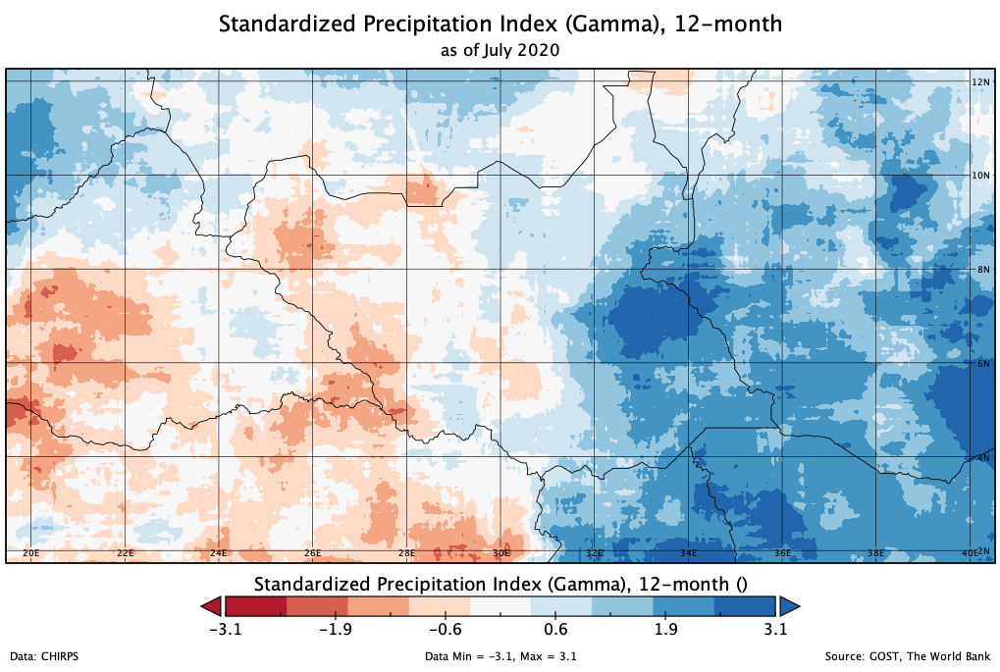
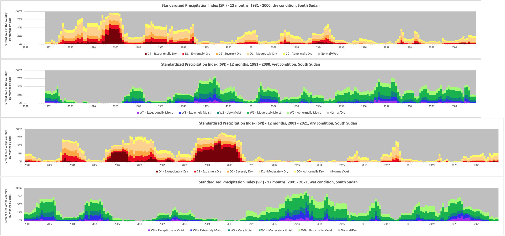
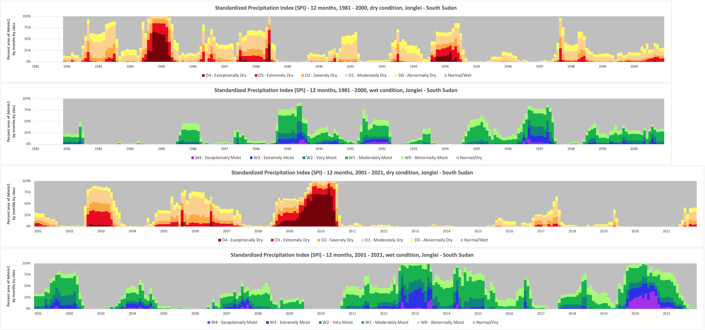

# Monitoring dry and wet season in South Sudan

Project: [FRAGILITY AND WATER SECURITY IN SUDAN AND SOUTH SUDAN (P177566)](http://operationsportal.worldbank.org/secure/P177566/home)

This activity aims to capture the dynamic linkages between water security and fragility in Sudan and South Sudan and identify opportunities for the World Bank Group to leverage water security interventions that can act as enablers of stability, peace and resilience.

The team are utilizing SPI based on CHIRPS global precipitation estimates data to monitor on how dry and wet cindition are evolving month by month and year by year. 

Picture below are some of the example, the worst flooding in 60 years in South Sudan are well captured through the data.

1. SPI-12 as of July 2020. A screenshot map from Panoply Data Viewer software

	

	??? Disclaimer
		Country borders or names do not necessarily reflect the World Bank Group's official position. This map is for illustrative purposes and does not imply the expression of any opinion on the part of the World Bank, concerning the legal status of any country or territory or concerning the delimitation of frontiers or boundaries.

2. SPI-12 average information for the country from 1981 - 2021.

	

3. SPI-12 average information for Jonglei from 1981 - 2021, prolonged wet condition from end of 2019 are inline with above map.

	